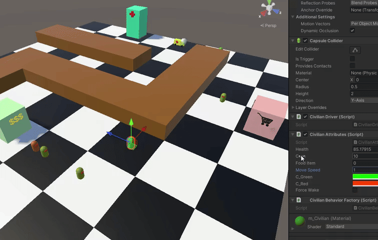
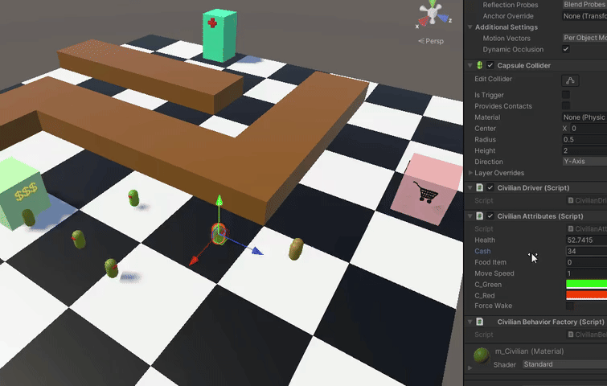

**Author:** Jaeyoung Oh  
**Affiliation:** BlueJayXRStudio (formerly BlueJayVRStudio)  
**Contact:** BlueJayVRStudio@gmail.com  

WORK IN PROGRESS

# Task Stack Machine, an "Infinite" Tree

  

Using Unity 2022.3.9f1 (Long Term Support)  

Novel Behavior Tree and State Machine Generalization.

## Glossary

- **[Task Stack Machine](./module/TaskStackMachine.cs)**: Task Stack Machine Runner/Driver implementation.
- **[Sequence Composite](./module/Composites/Sequence.cs)**: Sequence Composite implementation.
- **[Selector Composite](./module/Composites/Selector.cs)**: Selector Composite implementation.
- **[Parallel Composite](./module/Composites/Parallel.cs)**: Parallel Composite implementation.
- **[Comprehensive Demo](./module/Demos/ComprehensiveDemo/)**: A Unity Demo using Task Stack Machine.

> Central focus of this framework is smart use of stack memory and Task status messages to generalize action planning.  

> Type of action planning:
> 1. Procedural: Behavior Tree, Hierarchical Task Network Planning (`HTN`), Goal Oriented Action Planning (`GOAP`), etc.
>> - Pros: Highly expressive.
>> - Cons: Hard to construct (Unreal Engine resolves this by using node editor) and requires deep domain knowledge for the specific system we're implementing.
> 2. Reactive: Finite State Machine (`FSM`), etc.
>> - Pros: Can create smart emergent behaviors. 
>> - Cons: Difficult to decouple sequential behaviors. Some emergent behaviors may not be desired, which forces extensive robustness testing.

> The aim of Task Stack Machine is to generalize the two types of task planning frameworks by making use of stack memory
and a global access to the stack for each Task  
> Requirements for Task Stack Machine:  
> 
> **Note**: we will use "behaviors" and "tasks" interchangeably.
> 1. A Task is either Running or Done.
>> - If Running, return RUNNING status.
>> - If Done, return SUCCESS or FAILURE status.
> 2. A Task must receive status message and, more importantly, yield status message.
> 3. A Task can access shared memory.
> 4. A Tree must have a collection of Tasks. This can take many different forms including Stacks, Lists, Queues, or Priority Queue. 
Here, we will demonstrate the power of Stack memory in achieving wide variety of standard behaviors including procedural and reactive behaviors.

> Benefits
> - Loose coupling of behaviors,
>> - Behaviors are highly reusable,
>> - Leads to easy recursive state serialization,
>> - Each behavior can have a policy for decision making:
>>> - Priority queue for easy task prioritization in sequence nodes,
>>> - Machine/Deep Learning policies such as those used for PPO (training is "expensive", but reusability of behavior makes reinforcement learning highly viable),
>>> - Behavior nodes can be used to build a decision tree/graph with which we can run Dijkstra's algorithm for arbitrary cost optimization (GOAP),
>> - Behaviors are fully interpretable and traceable through OOP,
>> - Behaviors can act as a BT node or an FSM state,
> - Main tree can drive a full suite of standard behavior tree composites and decorators in an extremely compact and reproducible form,
>> - Approximate lines of code in .Net/C#:
>>> - Behavior tree: 50 lines, 
>>> - Behavior/Task Interface: 10 lines, 
>>> - Sequence/Selector Composite: 35 lines,
>>> - Parallel Composite: 45 lines,
>>> - Inverter Decorator: 30 lines,
>>> - Repeat Decorator: 0 line (Task can be made self-referential!) [BlueJay TODO: This is the part that connects BT back to FSM. A BT with Repeater + Selector + Blackboard -> Can simulate FSM]
> Cons
> - Can be difficult to debug. Very recursive in nature.
> - Lots of small scripts, but that may be a good thing in terms of OO principles.

## Formal Definition of the Task Stack Machine

**M = <T, S, μ, Σ, δ_tree, δ_task, t₀>**

| Symbol     | Description                                                                  |
|------------|------------------------------------------------------------------------------|
| `T`        | Set of all Tasks `t` (analogous to states `Q`)                               |
| `S`        | Set of all possible stacks over `T` (`Stack<T>`)                             |
| `Γ`        | Shared unbounded memory space (e.g. tape or arbitrary structured memory)     |
| `Σ`        | Set of status messages (`RUNNING`, `SUCCESS`, `FAILURE`)                     |
| `δ_tree`   | Scheduler/Dispatcher function: `Σ × S → T × S`                               |
| `δ_task`   | Task step function: `T × S × Γ × Σ → S × Γ × Σ`                              |
| `t₀ ∈ T`   | Initial task                                                                 |

Terminal states only exist at the Task level (`SUCCESS` or `FAILURE`), but the system itself (`δ_system`) is designed to run continuously, like a scheduler or dispatcher, awaiting new tasks.

Since we are working with unbounded memory in the forms of task stack and blackboard, our Task Stack Machine is a Turing complete machine. However, the usefulness of this framework does not come from Turing completeness, but rather from the structural differences between Task Stack Machine and other conventional AI backends such as FSM and Behavior Trees. 

### Behavior Tree (BT)

The implicit purpose of a BT is to drive an autonomous agent to a program completion, be it SUCCESS or FAILURE. Sequence node, for instance, sequentially (through pre-order DFS) invokes its children, and decides to continue iterating as long as its children output SUCCESS. In turn, Sequence node returns its own message to its parent (i.e. invoker, caller, etc.), and its parent will decide next course of action based on that message. So on and so forth recursively. While there is indeed an element of state transition in BT, the actual focus and intent is on defining a set of tasks that depend on the SUCCESS and FAILURE among one another. Thus, based on the semantics, a BT's function signature would look like this:  

`Task × Γ → Task x Γ x Σ`  
ExecuteFully(Subtask, Current Blackboard) = (Caller, Modified Blackboard, Status Message)

There is a subtask to caller transition and vice-versa, but no explicit transitions among nodes at the same hierarchy. BT does not allow arbitrary leaf to leaf transition or even composite to composite transition if they are not themselves contained within a parent composite. BT, therefore, strictly enforces logical or meaningful relationships among tasks. Although the presence of unbounded memory in the form of a blackboard does exist in BT and allows the flexibility to create an FSM if desired, it is simply not baked into the design.

### Finite State Machine (FSM)

FSM in a true definition is a simple machine; its state transitions depend only on external input alphabet (basic) and do not produce distinct outputs (Moore). Conventionally, however, FSM uses unbounded memory, making any computation possible. So, while it allows an arbitrary task to task transitions, it unfortunately means less reusability and modularity [7], which is what BT tries to resolve.

### Task Stack Machine (AKA Infinite Tree, TSM, ...)

Our Task Stack Machine attempts to resolve the intents of BT and FSM as a unified framework. By using a stack as a collection of tasks, we can simulate recursive function calls at the level of autonomous tasks, which inherently incorporates temporal dimension. Each task can call an arbitrary subtask by first pushing itself onto the stack then finally pushing the subtask with the message of RUNNING. At the end of that subtask's routine, status message of SUCCESS or FAILURE will be returned to the original task. This mirrors BT mechanisms exactly, and this module presents working examples of standard BT composites and decorators using TSM. On the other hand, FSM state transitions can be simulated by pushing the next state onto the task as RUNNING without first pushing the current task back onto the stack. In both BT and FSM under TSM generalization, a RUNNING task simply pushes itself back onto the task with the message of RUNNING without pushing any other task.

### Operating System and CPU Architecture

> *Another register is the stack pointer, which points to the top of the current stack in memory. The stack contains one frame for each procedure that has been entered but not yet exited. A procedure’s stack frame holds those input parameters, local variables, and temporary variables that are not kept in registers. - Tanenbaum, Modern Operating Systems [5]*

At the core of the Operating Systems model, we have a kernel that manages processes that can create multiple threads. Each thread has its own call stacks onto which it can push frames of procedures, AKA functions. In a typical CPU architecture, a procedure can call a new procedure, but it must be encapsulated in a new frame along with a return address to its original caller. The design yields a powerful programming paradigm that allows us to carry out complex recursive computations. However, it is surprisingly limited in autonomous systems or robotic policy representations, because a function f() cannot call itself without creating a new frame on the stack.

Because procedures in OS models cannot refer back to its original frame in the next execution cycle, it cannot in theory model an FSM which requires that a state be able to return back to itself across a temporal dimension. Even BT and HTN, which have recursive call structure, require that leaf nodes be able to continue running until they are ready to give control back to the parent composite. Thus, without an additional level of abstraction over procedural programming, it is impossible to achieve the kind of mechanisms desired by all currently existing autonomous policy representations such as FSM and BT (it must be noted that existing implementations of FSM and BT are in fact more than just a procedural programming paradigm). Therefore, there is a strong indication that there exists an alternative minimal system structure to emulate an autonomous agent - possibly even mimicking self-awareness to slightly exaggerate.

By encapsulating a function in an object structure, allowing free-form manipulation of the stack by the functions, and finally converting the responsibility of the call stack to that of keeping traces of object frames rather than procedure frames, we can achieve a fundamentally different type of computational paradigm that allows for the unification of various robotic policy representations. Additionally, flexible manipulation of the stack and clever use of OOP techniques allow each behavior or task to be able to gather hierarchical contextual information that could be used to create context aware adaptiveness and interruptibility in run time complexity that scales logarithmically with the number of tasks within a BT or HTN. That is practically in constant time.

For example, if we imagine a task such as "EatBehavior", we can quickly decompose this into a hierarchical structure. EatBehavior (sequence) requires that we have enough food (selector) and then finally eat it - a primitive, non-decomposable task that we will also refer to as *atomic operation*. Consequently having enough food requires that we look into our inventory, and atomic logical operation, and on failure to find food in the inventory, we must perform the action of getting food (sequence). An action of getting food requires that we have enough cash (another selector) and then finally purchase food. Having enough cash involves checking our wallet, then on low cash we can perform the action of withdrawing cash. Purchasing food and withdrawing cash are, of course, decomposable actions themselves.

The reason for pausing further description of the tree is not solely for brevity, but also to point out a recurring pattern: 

1. Sequence composing a selector followed by atomic action or another composite:
    -  Enforce success of the former, before performing the latter.

2. Selector composing an atomic logical operation followed by an atomic action or another sequence:
    - Enforce failure of a condition before taking an action to realize a goal.
    - Do return SUCCESS if the goal has been or was already realized. This ties it back together with a parent sequence composite which wishes to know if a requirement has been met in order to proceed with its own tasks. We are simply delegating that responsibility of checking the requirements to a selector composite.

Another layer of complexity:

1. When we are enforcing a requirement in order to continue with a task in a sequence, we have to decide whether the requirement SUCCESS persists over time. If a requirement must hold over time, then the current action must query the parent node to verify said persistence. If the result is FAILURE, then we can/must terminate the action prematurely.  
    - In other words, if *I* am performing something because I have met a certain requirement, but that requirement doesn't hold anymore, then I should stop doing what I'm doing. 

2. When we are enforcing a requirement to fail in order to continue with a task in a selector, we have to decide whether the requirement FAILURE persists over time. If a requirement must persistently fail, then the current action must query the parent node to verify the said persistence. If the result is SUCCESS, then we can/must terminate the action prematurely.  
    - In other words, if *I* am doing something so that I may realize a goal, but that goal has already been achieved, then I no longer have to do what I'm currently doing.

Interestingly, through independent system design and practical reasoning, this project reached the same conclusion as the cognitive-computational model illustrated in a work by Georgeff et al [tbd], *The Belief-Desire-Intention Model of Agency* (BDI). The work envisions an intelligent system whose actions are driven by *Desire* and controlled by Beliefs and Intention. At the top level of our "EatBehavior" tree, the implicit desire (but explicitly programmed within the main controller FSM) is to be satiated as a form of a selector. The belief, on the other hand, would be whether we are indeed satiated or not, and the intention is to engage in "EatBehavior" if we happen to be hungry. However, a selector is not the only form of desire that breaks down into a belief and intention. A decomposable task or a sequence is, in and of itself, a desire to perform a task, and hence requires a decomposition into a belief and intention. For instance, the desire to get food requires that we have enough cash before we can purchase food, meaning that we must believe that we have enough cash before even having the intent to purchase food. 

This symmetry rises from the operational equivalence of a sequence and a selector. In both composites, the continuation of subsequent leaf nodes depends on the previous leaves' results and the persistence of those results. Meaning, placing a leaf node before another necessitates the former to act as an element of belief. The term *Desire* simply encapsulates this patterned operation, whereas *Intention* serves as a semantically distinguishable form of decomposable or atomic actions such as verbs in grammar.

By using these patterns, it is now possible to recursively travel up the parent composites (which implies that they themselves are RUNNING) to check for all existing early termination conditions, which are created by default on behavior tree construction. Since we are only checking the persistence of previously completed tasks, the checking process will not traverse back down to the child nodes, keeping the entire recursive operation at O(N) where N is the number of nodes in the behavior tree. In practice, that is a constant operation. 

Of course, there are still edge cases involving how to handle belief persistence of a non-logical atomic operations. For instance, are we satisfied that we have performed the action in the past, or is its success only valid at the moment of its completion? In our context, the success of an action should not persist once it has been completed, because when we are traversing the stack memory, we are mainly utilizing requirements as contained in the atomic logical operations encapsulated by a selector. Since a selector will return SUCCESS if any of its children returns SUCCESS, the SUCCESS persistence of an atomic operation (non-logical) will nullify falsity of the logical atomic operation, which will result in the failure of proper early termination of the atomic action that is making the query in the moment. However, for now we will assume this is implementation specific and defer it to future studies of this framework in various perspectives including linear temporal logic (LTL) and perhaps multi-valued logic.

In our "EatBehavior" tree we have three distinct decision paths:

1. not enough health -> enough food -> Eat Food
2. not enough health -> not enough food -> enough cash -> To Grocery Store
3. not enough health -> not enough food -> not enough cash -> To ATM

In all three cases, suddenly having enough health should override the current action of either eating food, going to the grocery store or going to the ATM. In cases two and three, having enough food should override the action of going to the grocery store or the ATM. Finally, having enough cash should override the action of going to the ATM. Although this kind of logic can be implemented using a blackboard and an FSM or BT, without a clear structure or strategy to accomodate requirements and interruptibility, we will inevitably face combinatorial explosion in development time and riddles in safety verifications and reachability analysis. For example, something that might have caught many developers off is the fact that suddenly not having enough food should also override the action of eating food. Similarly, suddenly not having enough cash on the way to the grocery store should prompt the agent to terminate its action of going to the grocery store. For anyone, that is simply way too many edge cases to handle without a structured approach. However, by taking advantage of cognitive models in task management such as that suggested by BDI and combining it with the computational model of Task Stack Machine and recursive Task to Task invocations, we can easily implement a system to automatically handle all of these termination cases. Practical demonstration is provided in this GitHub repository [16].

#### Enough Health interrupts Going To Store

  

#### Enough Food interrupts Going To Store

  

#### Not Enough Cash interrupts Going To Store

  

#### Enough Health interrupts Going To ATM

  

#### Enough Food interrupts Going To ATM

  

#### Enough Cash interrupts Going To ATM

  

### TSM Sequence Composite Design

Sequence in Natural Language: "If *I* have previously failed, then I will stop the sequence. Otherwise, if I have run out of tasks, then I have succeeded and should exit. Otherwise I will continue with the next task in queue/list."

In the very beginning of the algorithm, we push the sequence task back into stack memory, because we want the status message of its subtasks (from the queue) to be propagated back to the sequence task. On SUCCESS or FAILURE of the sequence task, we still want to push it back into memory, because we want TSM to associate that status message with the sequence itself and no other task in the stack.

  

Here, we have a state diagram of the Sequence Composite in action. Coordination between TSM and the Sequence composite yields this exact mechanism. One thing to note is that the sequence is the bottom most task in the stack, meaning there is no other caller than the main procedural program. Thus, we do not need to propagate any status message to a caller, which does not exist, and therefore TSM will continue its iterations with a RUNNING status. 

  

On the otherhand, 

### TSM-FSM Design

FSM, on the other hand, 

  
  

## References

1. Erol, K., Hendler, J. A., & Nau, D. S. (1994, June). UMCP: A sound and complete procedure for hierarchical task-network planning. In Aips (Vol. 94, pp. 249-254).
2. Orkin, J. (2006, March). Three states and a plan: the AI of FEAR. In Game developers conference (Vol. 2006, p. 4). SanJose, California: CMP Game Group.
3. Jeff, O. R. K. I. N. (2003). Applying goal-oriented action planning to games. AI game programming wisdom, 2, 217-228.
4. Rajeev Alur, Michael Benedikt, Kousha Etessami, Patrice Godefroid, Thomas Reps, and Mihalis Yannakakis. 2005. Analysis of recursive state machines. ACM Trans. Program. Lang. Syst. 27, 4 (July 2005), 786–818. https://doi.org/10.1145/1075382.1075387
5. John E. Hopcroft, Rajeev Motwani, and Jeffrey D. Ullman. 2001. Introduction to automata theory, languages, and computation, 2nd edition. SIGACT News 32, 1 (March 2001), 60–65. https://doi.org/10.1145/568438.568455
6. Andrew S. Tanenbaum and Herbert Bos. 2014. Modern Operating Systems (4th. ed.). Prentice Hall Press, USA.
7. Clarke, E. M., Grumberg, O., & Peled, D. A. (1999). Model checking. MIT Press.
8. Turing, A.M. (1937), On Computable Numbers, with an Application to the Entscheidungsproblem. Proceedings of the London Mathematical Society, s2-42: 230-265. https://doi.org/10.1112/plms/s2-42.1.230
9. Iovino, M., Förster, J., Falco, P., Chung, J. J., Siegwart, R., & Smith, C. (2024). Comparison between Behavior Trees and Finite State Machines. arXiv preprint arXiv:2405.16137.
10. Corrado Pezzato, Carlos Hernández Corbato, Stefan Bonhof, and Martijn Wisse. 2023. Active Inference and Behavior Trees for Reactive Action Planning and Execution in Robotics. Trans. Rob. 39, 2 (April 2023), 1050–1069. https://doi.org/10.1109/TRO.2022.3226144
11. Michael P. Georgeff, Barney Pell, Martha E. Pollack, Milind Tambe, and Michael Wooldridge. 1998. The Belief-Desire-Intention Model of Agency. In Proceedings of the 5th International Workshop on Intelligent Agents V, Agent Theories, Architectures, and Languages (ATAL '98). Springer-Verlag, Berlin, Heidelberg, 1–10.
12. Epic Games, *Behavior Trees in Unreal Engine*, Unreal Engine Documentation, [Online]. Available: https://dev.epicgames.com/documentation/en-us/unreal-engine/behavior-trees-in-unreal-engine. [Accessed: Mar. 27, 2025].
13. Splintered Reality, *py_trees*, GitHub repository, [Online]. Available: https://github.com/splintered-reality/py_trees
14. EugenyN, *BehaviorTrees*, GitHub repository, [Online]. Available: https://github.com/EugenyN/BehaviorTrees
15. Eraclys, *BehaviourTree*, GitHub repository, [Online]. Available: https://github.com/Eraclys/BehaviourTree
16. BlueJayXRStudio, *InfiniteTree*, GitHub repository, [Online]. Available: https://github.com/BlueJayXRStudio/InfiniteTree