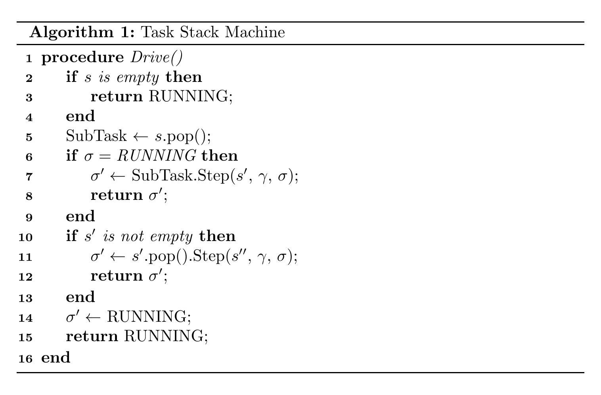
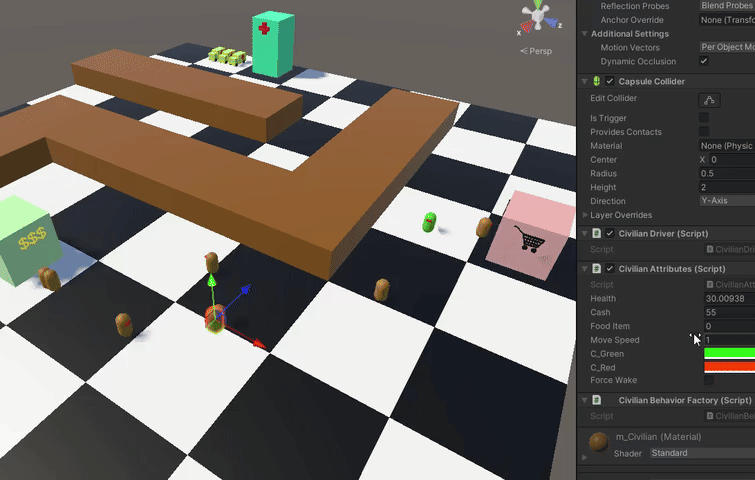
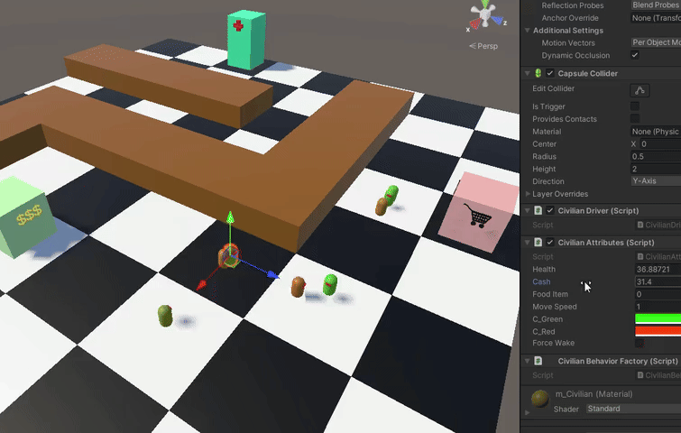

**Author:** Jaeyoung Oh  
**Affiliation:** BlueJayXRStudio (formerly BlueJayVRStudio)  
**Contact:** BlueJayVRStudio@gmail.com  

# Task Stack Machine: An "Infinite" Tree for Unified Task Planning

  

Using Unity 2022.3.9f1 (Long Term Support)  

## Glossary

- **[Task Stack Machine](./module/TaskStackMachine.cs)**: Task Stack Machine Runner/Driver implementation.
- **[Sequence Composite](./module/Composites/Sequence.cs)**: Sequence Composite implementation.
- **[Selector Composite](./module/Composites/Selector.cs)**: Selector Composite implementation.
- **[Parallel Composite](./module/Composites/Parallel.cs)**: Parallel Composite implementation.
- **[Comprehensive Demo](./module/Demos/ComprehensiveDemo/)**: A Unity Demo using Task Stack Machine.

## Abstract

This paper introduces the Task Stack Machine (TSM), a minimal and general-purpose framework for agent behavior execution that unifies procedural and reactive planning models, such as Behavior Trees (BT), Finite State Machines (FSM), and Goal-Oriented Action Planning (GOAP). At the core of TSM is a globally accessible stack and a set of task status messages (RUNNING, SUCCESS, FAILURE) that enable recursive task invocation, early termination, and belief-aware control flow. We show that common composites like Sequence and Selector, as well as FSM transitions, emerge naturally from this structure using less than 20 lines of code. TSM provides a structural alternative to the call stack model in classical procedural systems, allowing tasks to re-enter themselves or parent composites without adding new frames, thus capturing intention persistence and interruptibility over time. Interestingly, the framework independently converges on cognitive patterns aligned with the Belief-Desire-Intention (BDI) model of agency, with belief conditions embedded in the structure and flow of the tree itself. We present formal definitions, illustrative diagrams, and a Unity-based demonstration. Our implementation shows that TSM enables scalable, interruptible behaviors without combinatorial explosion, offering a reusable foundation for complex agent behavior in games, robotics, and simulation systems.

## Introduction

Intelligent agents, whether in games, robotics, or simulations, rely on structured behavior models to make decisions and execute actions. Classical approaches such as Finite State Machines (FSMs) and Behavior Trees (BTs) have become industry standards due to their interpretability and modularity. However, both suffer from limitations in scalability, expressiveness, and task reuse, particularly when dealing with complex conditional logic, recursive behaviors, or belief-driven intention interruption.

Higher-level planning frameworks, such as Hierarchical Task Networks (HTNs) and Goal-Oriented Action Planning (GOAP), offer more expressiveness but come at the cost of complexity, brittleness, and poor runtime transparency. Meanwhile, cognitive agent architectures like BDI provide theoretical guidance but are rarely integrated into practical task execution systems.

This paper introduces the Task Stack Machine (TSM), a minimal yet expressive execution framework that unifies reactive and procedural planning through the use of stack-based task scheduling and status message propagation. In TSM, tasks can dynamically invoke or replace subtasks, query belief states, and self-terminate based on runtime context, all within a compact execution engine of fewer than 20 lines of core logic.

The primary contributions of this work are:

- A formal definition of the TSM model as a unifying abstraction for FSM, BT, and GOAP paradigms
- An implementation of standard behavior composites (e.g., Sequence, Selector) using stack-based recursion
- A demonstration of belief-based early termination logic inspired by the Belief-Desire-Intention (BDI) model
- A working Unity demo with traceable behavior flow and interruptibility logic 

By offering an alternative control model that is both structurally elegant and practically implementable, TSM bridges the gap between symbolic planning and runtime autonomy, and opens new avenues for building more robust, scalable, and introspectable intelligent agents.

## Related Work

Traditional task planning systems are typically categorized as procedural or reactive. Procedural models include Behavior Trees (BT) [1-4], Hierarchical Task Networks (HTN) [5], and Goal-Oriented Action Planning (GOAP) [6,7], which offer high expressivity but are often hard to scale or debug. Reactive models such as Finite State Machines (FSM) offer simplicity and emergent behavior [8,9], but struggle with behavior sequencing, state persistence, and task reuse.

Recent efforts have sought to enhance planning expressiveness using blackboard systems, active inference [10], or hybridized BT-HFSM models [11], though most retain the structural limitations of their base architectures. Formal frameworks like recursive state machines [12], model checking [13], and automata theory [8] provide theoretical tools for analyzing such systems, but are rarely used to guide real-world execution models.

The Belief-Desire-Intention (BDI) model [14] remains foundational in cognitive agent theory, but implementations often rely on rule-based engines with limited runtime introspection or task-level interruptibility. Similarly, procedural languages and operating system models (e.g., stack-based execution [15]) do not easily support intention persistence or runtime task adaptation, highlighting a gap between computational tractability and cognitive expressiveness.

This paper addresses that gap by presenting the Task Stack Machine, which unifies planning and reactivity in a structurally recursive, intention-aware, and practically implementable architecture.

## Formal Definition of the Task Stack Machine

**M = <T, S, μ, Σ, δ_tree, δ_task, t₀>**

| Symbol     | Description                                                                  |
|------------|------------------------------------------------------------------------------|
| `T`        | Set of all Tasks `t` (analogous to states `Q`)                               |
| `S`        | Set of all possible stacks over `T` (`Stack<T>`)                             |
| `Γ`        | Shared unbounded memory space (e.g. tape or arbitrary structured memory)     |
| `Σ`        | Set of status messages (`RUNNING`, `SUCCESS`, `FAILURE`)                     |
| `δ_tree`   | Scheduler/Dispatcher function: `Σ × S → T × S`                               |
| `δ_task`   | Task step function: `T × S × Γ × Σ → S × Γ × Σ`                              |
| `t₀ ∈ T`   | Initial task                                                                 |

Terminal states only exist at the Task level (`SUCCESS` or `FAILURE`), but the system itself (`δ_system`) is designed to run continuously, like a scheduler or dispatcher, awaiting new tasks.

Since we are working with unbounded memory in the forms of task stack and blackboard, our Task Stack Machine is a Turing complete machine [16]. However, the usefulness of this framework does not come from Turing completeness, but rather from the structural differences between Task Stack Machine and other conventional AI backends such as FSM and Behavior Trees. 

## Comparisons

### Behavior Tree (BT)

The implicit purpose of a BT is to drive an autonomous agent to a program completion, be it SUCCESS or FAILURE. Sequence node, for instance, sequentially (through pre-order DFS) invokes its children, and decides to continue iterating as long as its children output SUCCESS. In turn, Sequence node returns its own message to its parent (i.e. invoker, caller, etc.), and its parent will decide next course of action based on that message. So on and so forth recursively. While there is indeed an element of state transition in BT, the actual focus and intent is on defining a set of tasks that depend on the SUCCESS and FAILURE among one another. Thus, based on the semantics, a BT's function signature would look like this:  

`Task × Γ → Task x Γ x Σ`  
ExecuteFully(Subtask, Current Blackboard) = (Caller, Modified Blackboard, Status Message)

There is a subtask to caller transition and vice-versa, but no explicit transitions among nodes at the same hierarchy. BT does not allow arbitrary leaf to leaf transition or even composite to composite transition if they are not themselves contained within a parent composite. BT, therefore, strictly enforces logical or meaningful relationships among tasks. Although the presence of unbounded memory in the form of a blackboard does exist in BT and allows the flexibility to create an FSM if desired, it is simply not baked into the design.

### Finite State Machine (FSM)

FSM in a true definition is a simple machine; its state transitions depend only on external input alphabet (basic) and do not produce distinct outputs (Moore). Conventionally, however, FSM uses unbounded memory, making any computation possible. So, while it allows an arbitrary task to task transitions, it unfortunately means less reusability and modularity [9], which is what BT tries to resolve.

### Task Stack Machine (TSM, "Infinite Tree")

Our Task Stack Machine attempts to resolve the intents of BT and FSM as a unified framework. By using a stack as a collection of tasks, we can simulate recursive function calls at the level of autonomous tasks, which inherently incorporates temporal dimension. Each task can call an arbitrary subtask by first pushing itself onto the stack then finally pushing the subtask with the message of RUNNING. At the end of that subtask's routine, status message of SUCCESS or FAILURE will be returned to the original task. This mirrors BT mechanisms exactly, and this module presents working examples of standard BT composites and decorators using TSM. On the other hand, FSM state transitions can be simulated by pushing the next state onto the task as RUNNING without first pushing the current task back onto the stack. In both BT and FSM under TSM generalization, a RUNNING task simply pushes itself back onto the task with the message of RUNNING without pushing any other task.

### Operating System and CPU Architecture

> *Another register is the stack pointer, which points to the top of the current stack in memory. The stack contains one frame for each procedure that has been entered but not yet exited. A procedure’s stack frame holds those input parameters, local variables, and temporary variables that are not kept in registers. - Tanenbaum, Modern Operating Systems [15]*

To further clarify the novelty of TSM, it helps to contrast it with how procedural execution models, such as those used in operating systems, manage task control. At the core of the Operating Systems model, we have a kernel that manages processes that can create multiple threads. Each thread has its own call stacks onto which it can push frames of procedures, AKA functions. In a typical CPU architecture, a procedure can call a new procedure, but it must be encapsulated in a new frame along with a return address to its original caller. The design yields a powerful programming paradigm that allows us to carry out complex recursive computations. However, it is surprisingly limited in autonomous systems or robotic policy representations, because a function cannot call itself without creating a new frame on the stack.

Because procedures in OS models cannot refer back to its original frame in the next execution cycle, it cannot in theory model an FSM which requires that a state be able to return back to itself across a temporal dimension. Even BT and HTN, which have recursive call structure, require that leaf nodes be able to continue running until they are ready to give control back to the parent composite. Thus, without an additional level of abstraction over procedural programming, it is impossible to achieve the kind of mechanisms desired by all currently existing autonomous policy representations such as FSM and BT (it must be noted that existing implementations of FSM and BT are in fact more than just a procedural programming paradigm). Therefore, there is a strong indication that there exists an alternative minimal system structure to emulate an autonomous agent - possibly even mimicking self-awareness to slightly exaggerate.

By encapsulating a function in an object structure, allowing free-form manipulation of the stack by the functions, and finally converting the responsibility of the call stack to that of keeping traces of object frames rather than procedure frames, we can achieve a fundamentally different type of computational paradigm that allows for the unification of various robotic policy representations. Additionally, flexible manipulation of the stack and clever use of OOP techniques allow each behavior or task to be able to gather hierarchical contextual information that could be used to create context aware adaptiveness and interruptibility in run time complexity that scales linearly in worst case with the number of tasks within a BT or HTN. In practice that is a constant operation.

### TSM in Practice

For example, if we imagine a task such as "EatBehavior", we can quickly decompose this into a hierarchical structure. EatBehavior (sequence) requires that we have enough food (selector) and then finally eat it - a primitive, non-decomposable task that we will also refer to as *atomic operation*. Consequently having enough food requires that we look into our inventory, and atomic logical operation, and on failure to find food in the inventory, we must perform the action of getting food (sequence). An action of getting food requires that we have enough cash (another selector) and then finally purchase food. Having enough cash involves checking our wallet, then on low cash we can perform the action of withdrawing cash. Purchasing food and withdrawing cash are, of course, decomposable actions themselves.

At this point, we can notice a recurring pattern: 

1. A Sequence node composed of a Selector followed by atomic action or another composite:
    -  Enforces success of the former, before performing the latter.

2. A Selector composed of an atomic logical operation followed by an atomic action or another sequence:
    - Enforces failure of a condition before taking an action to realize a goal or requirements.
    - Returns SUCCESS if the goal has already been achieved. It signals to a parent sequence composite a requirement has been met and can continue with the next tasks in the sequence. We are simply delegating the checking responsibility to a selector composite.

Another layer of complexity arises when we consider temporal persistence of conditions:

1. When we are enforcing a requirement in order to continue with a task in a sequence, we have to decide whether the requirement SUCCESS persists over time. If a requirement must hold over time, then the current action must query the parent node to verify said persistence. If the result is FAILURE, then we can/must terminate the action prematurely.  
    - In other words, if *I* am performing something because I have met a certain requirement, but that requirement doesn't hold anymore, then I should stop doing what I'm doing. 

2. When we are enforcing a requirement to fail in order to continue with a task in a selector, we have to decide whether the requirement FAILURE persists over time. If a requirement must persistently fail, then the current action must query the parent node to verify the said persistence. If the result is SUCCESS, then we can/must terminate the action prematurely.  
    - In other words, if *I* am doing something so that I may realize a goal, but that goal has already been achieved, then I no longer have to do what I'm currently doing.

Interestingly, through independent system design and practical reasoning, this project reached the same conclusion as the cognitive-computational model illustrated in a work by Georgeff et al. [14], *The Belief-Desire-Intention Model of Agency* (BDI). The work envisions an intelligent system whose actions are driven by *Desire* and controlled by Beliefs and Intention. At the top level of our "EatBehavior" tree, the implicit desire (but explicitly programmed within the main controller FSM) is to be satiated as a form of a selector. The belief, on the other hand, would be whether we are indeed satiated or not, and the intention is to engage in "EatBehavior" if we happen to be hungry. However, a selector is not the only form of desire that breaks down into a belief and intention. A decomposable task or a sequence is, in and of itself, a desire to perform a task, and hence requires a decomposition into a belief and intention. For instance, the desire to get food requires that we have enough cash before we can purchase food, meaning that we must believe that we have enough cash before even having the intent to purchase food.

This symmetry rises from the operational equivalence of a sequence and a selector. In both composites, the continuation of subsequent leaf nodes depends on the previous leaves' results and the persistence of those results. Meaning, placing a leaf node before another necessitates the former to act as an element of belief. The term *Desire* simply encapsulates this patterned operation, whereas *Intention* serves as a semantically distinguishable form of decomposable or atomic actions such as verbs in grammar.

By using these patterns, it is now possible to recursively travel up the parent composites (which implies that they themselves are RUNNING) to check for all existing early termination conditions, which are created by default on behavior tree construction. Since we are only checking the persistence of previously completed tasks, the checking process will not traverse back down to the child nodes, keeping the entire recursive operation at O(N) where N is the number of nodes in the behavior tree. In practice, that is a constant operation. 

Of course, there are still edge cases involving how to handle belief persistence of a non-logical atomic operations. For instance, are we satisfied that we have performed the action in the past, or is its success only valid at the moment of its completion? In our context, the success of an action should not persist once it has been completed, because when we are traversing the stack memory, we are mainly utilizing requirements as contained in the atomic logical operations encapsulated by a selector. Since a selector will return SUCCESS if any of its children returns SUCCESS, the SUCCESS persistence of an atomic operation (non-logical) will nullify falsity of the logical atomic operation, which will result in the failure of proper early termination of the atomic action that is making the query in the moment. However, for now we will assume this is implementation specific and defer it to future studies of this framework in various perspectives including linear temporal logic (LTL) and perhaps multi-valued logic.

In our "EatBehavior" tree we have three distinct decision paths:

1. not enough health -> enough food -> Eat Food
2. not enough health -> not enough food -> enough cash -> To Grocery Store
3. not enough health -> not enough food -> not enough cash -> To ATM

In all three cases, suddenly having enough health should override the current action of either eating food, going to the grocery store or going to the ATM. In cases two and three, having enough food should override the action of going to the grocery store or the ATM. Finally, having enough cash should override the action of going to the ATM. Although this kind of logic can be implemented using a blackboard and an FSM or BT, without a clear structure or strategy to accommodate requirements and interruptibility, we will inevitably face combinatorial explosion in development time and riddles in safety verifications and reachability analysis. For example, something that might have caught many developers off is the fact that suddenly not having enough food should also override the action of eating food. Similarly, suddenly not having enough cash on the way to the grocery store should prompt the agent to terminate its action of going to the grocery store. For anyone, that is simply way too many edge cases to handle without a structured approach. However, by taking advantage of cognitive models in task management such as that suggested by BDI and combining it with the computational model of Task Stack Machine and recursive Task to Task invocations, we can easily implement a system to automatically handle all of these termination cases. Practical demonstration is provided in our (this) GitHub repository [17].

#### Enough Health interrupts Going To Store

  

#### Enough Food interrupts Going To Store

  

#### Not Enough Cash interrupts Going To Store

  

#### Enough Health interrupts Going To ATM

  

#### Enough Food interrupts Going To ATM

  

#### Enough Cash interrupts Going To ATM

  

## TSM Sample Components

### TSM Sequence Composite Design

Sequence in Natural Language: "If *I* have previously failed, then I will stop the sequence. Otherwise, if I have run out of tasks, then I have succeeded and should exit. Otherwise I will continue with the next task in queue/list."

In the very beginning of the algorithm, we push the sequence task back into stack memory, because we want the status message of its subtasks (from the queue) to be propagated back to the sequence task. On SUCCESS or FAILURE of the sequence task, we still want to push it back into memory, because we want TSM to associate that status message with the sequence itself and no other task in the stack.

  

Here, we have a state diagram of the Sequence Composite in action. Coordination between TSM and the Sequence composite yields this exact mechanism. Important note here is that the sequence is the bottom most task in the stack, meaning there is no other caller than the main procedural program. Thus, we do not need to propagate any status message to a caller, which does not exist in this specific instance, and therefore TSM will continue its iterations with a RUNNING status. 

  

On the otherhand, if the sequence had been called by another task and the sequence completed, then the SUCCESS or FAILURE message will be propagated back to the caller when the TSM invokes step function of the caller.

### TSM-FSM Design

Step function of an FSM task, algorithmically speaking, is really simple. It takes in the same parameters as any other behavioral task in order to perform some arbitrary computation. Then it takes those same parameter to determine the next state. In contrast to a behavior tree, however, FSM does not need to push more than a single state to the stack. It simply needs to push the next state and return RUNNING. The total possible state transitions are all ordered pairs of the states in the state set Q with repetitions allowed. Same principles apply here as any other finite state machine implementations.

  
  

Finally, the state diagram above shows the true power of TSM. Instead of having to rely on two separate systems for BT and FSM, we can now directly invoke a BT from an FSM. The state four in the diagram has the option to run a sequence node on specified inputs. To achieve that, it simply needs to push itself back onto the stack, then push the sequence task, and then finally return RUNNING. When the sequence completes with SUCCESS or FAILURE, the caller, state four, will receive the status message. 

In the Unity comprehensive demo, civilian control flow, civilian health monitor and EMS control flow are all examples of finite state machine, and they demonstrate the flexible use of TSM for practical applications. Both civilian control flow and EMS control flow are single-state machines responsible for invoking their respective behavior trees. Civilians require "EatBehavior" on low health, whereas EMS vehicles require "TransportPatient" behavior on emergency call notification. 

Civilian health monitor is a cyclic loop of three distinct states responsible for enforcing health states of civilians. As long as the civilians' health are above a certain level, this machine will stay in an idle state. Once it is below that threshold, it first acts as a kill-switch to the parallel civilian control flow and then transition to an unconscious state. Once it is in the unconscious state, the EMS, an external agent, is responsible for notifying the health monitor that their respective civilian is free to wake up. Once that message has been received, unconscious state will transition to a recovery state where civilians will passively gain health points until health is above a set threshold. Finally, the health monitor will resume the civilian's activity by reinstantiating the civilian control flow and transitioning back into the health monitor idle state.   

## Discussion and Conclusion

This work demonstrates that the Task Stack Machine (TSM) provides a minimal yet powerful framework for unifying diverse planning strategies, including Behavior Trees (BTs), Finite State Machines (FSMs), and Goal-Oriented Action Planning (GOAP), under a single recursive task-execution model. By treating tasks as reentrant objects operating on a shared stack, TSM enables belief-sensitive intention execution, real-time interruptibility, and modular control flow, all through a highly compact architecture. Core constructs like Sequence and Selector composites, as well as FSM-like transitions, arise naturally from the design using an engine of fewer than 20 lines of code.

One of the most significant outcomes is that cognitive semantics emerge structurally from the system. Belief-checking precedes intention execution, and early termination occurs automatically when belief conditions are no longer met, reflecting the key principles of the Belief-Desire-Intention (BDI) model [14]. This convergence was not imposed a priori but surfaced organically through iterative system design, reinforcing the model's cognitive validity and practical relevance.

To evaluate TSM beyond theory, we developed a working Unity based demo simulating agent interactions in an autonomous urban environment. The scenario includes civilians governed by behavior trees, health monitors implemented as FSMs, and EMS vehicles responding to health events. All agents operate within the TSM protocol, allowing for clean task invocation, belief-driven termination, and reusability of behaviors across contexts. Notably, belief changes mid-execution (e.g., gaining health, finding food, or running out of cash) correctly trigger early exits from ongoing behaviors, a difficult challenge for conventional BT or FSM systems to handle without considerable manual logic.

These results suggest TSM is especially well-suited for domains where behavior modularity, reusability, and context-aware responsiveness are paramount, including game AI, robotics, simulation, and interactive agents. Its object-oriented structure also supports integration with learning algorithms or graph-based optimizations, where interpretable, traceable policy structures are desirable.

That said, the framework is not without limitations. The recursive stack introspection required for belief re-evaluation can be harder to debug in large or deeply nested trees without proper tooling. Additionally, some ambiguity remains around belief persistence in non-logical atomic actions, which may require domain-specific conventions or extensions to the framework.

Future work will explore more formalized integrations with linear temporal logic (LTL), multi-valued logic systems, and reinforcement learning pipelines where traceable, goal-conditioned behavior policies are increasingly important.

The complete implementation, including source code and demo, is available as an open-source Unity project. Overall, the Task Stack Machine shows that intention-aware, belief-responsive task planning is not only theoretically elegant, but also highly practical, and achievable with minimal computational overhead.

## Acknowledgments

This work was sponsored by beloved supporters of BlueJayXRStudio (formerly BlueJayVRStudio)!

## References

1. Epic Games. Behavior trees in unreal engine. https://dev.epicgames.com/documentation/en-us/unreal-engine/behavior-trees-in-unreal-engine, 2025. Unreal Engine Documentation.
2. Splintered Reality. py_trees. https://github.com/splintered-reality/py_trees, 2025. GitHub repository.
3. Eraclys. Behaviourtree. https://github.com/Eraclys/BehaviourTree, 2025. GitHub repository.
4. EugenyN. Behaviortrees. https://github.com/EugenyN/BehaviorTrees, 2025. GitHub repository.
5. Kutluhan Erol, James A Hendler, and Dana S Nau. Umcp: A sound and complete procedure for hierarchical task-network planning. In Aips, volume 94, pages 249–254, 1994.
6. Jeff Orkin. Three states and a plan: the ai of fear. In Game developers conference, volume 2006, page 4. Citeseer, 2006.
7. ORKIN Jeff. Applying goal-oriented action planning to games. AI game programming wisdom, 2:217–228, 2003.
8. John E Hopcroft, Rajeev Motwani, and Jeffrey D Ullman. Introduction to automata theory, languages, and computation. Acm Sigact News, 32(1):60–65, 2001.
9. Matteo Iovino, Julian Förster, Pietro Falco, Jen Jen Chung, Roland Siegwart, and Christian Smith. Comparison between behavior trees and finite state machines. arXiv preprint arXiv:2405.16137, 2024.
10. Corrado Pezzato, Carlos Hernández Corbato, Stefan Bonhof, and Martijn Wisse. Active inference and behavior trees for reactive action planning and execution in robotics. IEEE Transactions on Robotics, 39(2):1050–1069, 2023.
11. Joshua M Zutell, David C Conner, and Philipp Schillinger. Flexible behavior trees: In search of the mythical hfsmbth for collaborative autonomy in robotics. arXiv preprint arXiv:2203.05389, 2022.
12. Rajeev Alur, Michael Benedikt, Kousha Etessami, Patrice Godefroid, Thomas Reps, and Mihalis Yannakakis. Analysis of recursive state machines. ACM Transactions on Programming Languages and Systems (TOPLAS), 27(4):786–818, 2005.
13. Edmund M Clarke. Model checking. In Foundations of Software Technology and Theoretical Computer Science: 17th Conference Kharagpur, India, December 18–20, 1997 Proceedings 17, pages 54–56. Springer, 1997.
14. Michael Georgeff, Barney Pell, Martha Pollack, Milind Tambe, and Michael Wooldridge. The belief-desireintention model of agency. In Intelligent Agents V: Agents Theories, Architectures, and Languages: 5th International Workshop, ATAL’98 Paris, France, July 4–7, 1998 Proceedings 5, pages 1–10. Springer, 1999.
15. Andrew S Tanenbaum and Herbert Bos. Modern operating systems. Pearson Education, Inc., 2015.
16. Alan Mathison Turing et al. On computable numbers, with an application to the entscheidungsproblem. J. of Math, 58(345-363):5, 1936.
17. BlueJayXRStudio. Infinitetree. https://github.com/BlueJayXRStudio/InfiniteTree, 2025. GitHub repository.